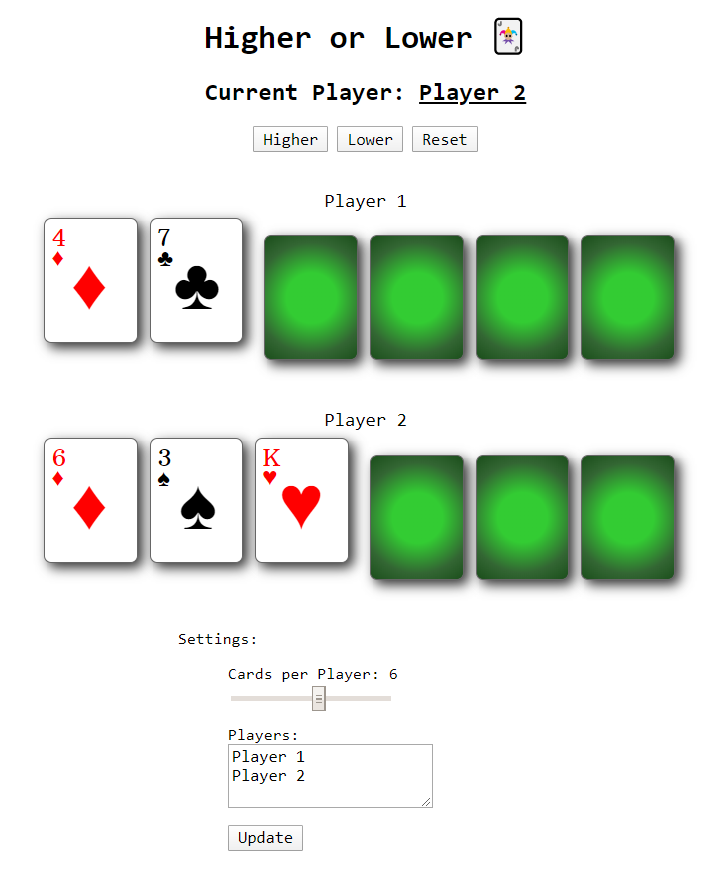

# Higher or Lower :black_joker:

Multiplayer card game built using Vue.js.

The rules can be found on the [site](https://higherorlower.rishk.me).

Supports a customisable number of players, cards per player and dark mode.

Playing Card Design:
[CSS-Playing-Cards](http://selfthinker.github.com/CSS-Playing-Cards/)

