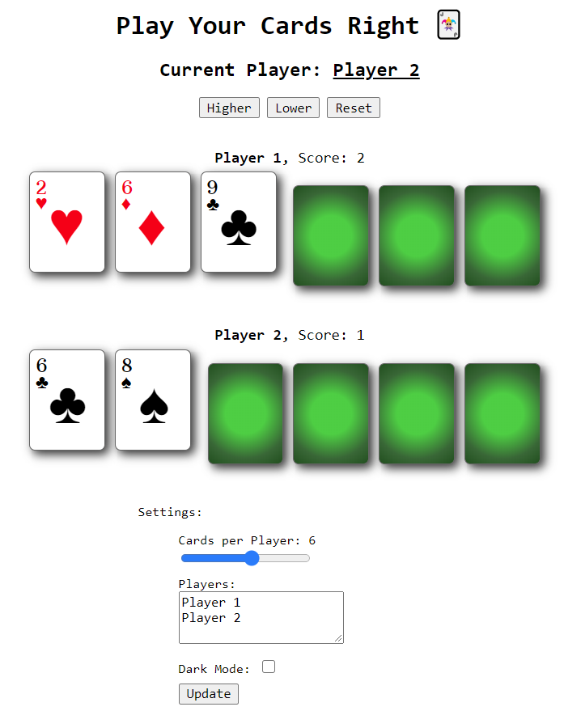

# Play Your Cards Right :black_joker:

Multiplayer card game built using Vue.js.

The rules can be found on the [site](https://games.rishk.me/play-your-cards-right/).

Features include:

  - Customisable number of players.
  - Customisable cards per player.
  - Dark mode.
  - Ability to save settings.

Playing Card Design:
[CSS-Playing-Cards](http://selfthinker.github.com/CSS-Playing-Cards/)

