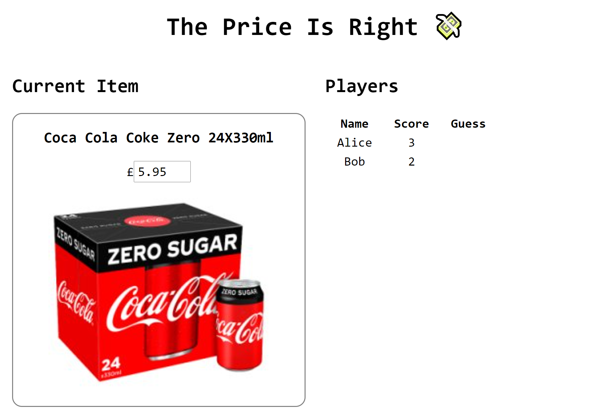

# The Price Is Right :money_with_wings:

Multiplayer guessing game built using WebRTC.

Players compete to guess the value of everyday retail items.

Features include:

  - Unlimited instances of the game.
  - Unique link that the game host can share with players.
  - Over 200 of the most popular products from Tesco.
  - Leaderboard, including all guesses at the end of each round.

